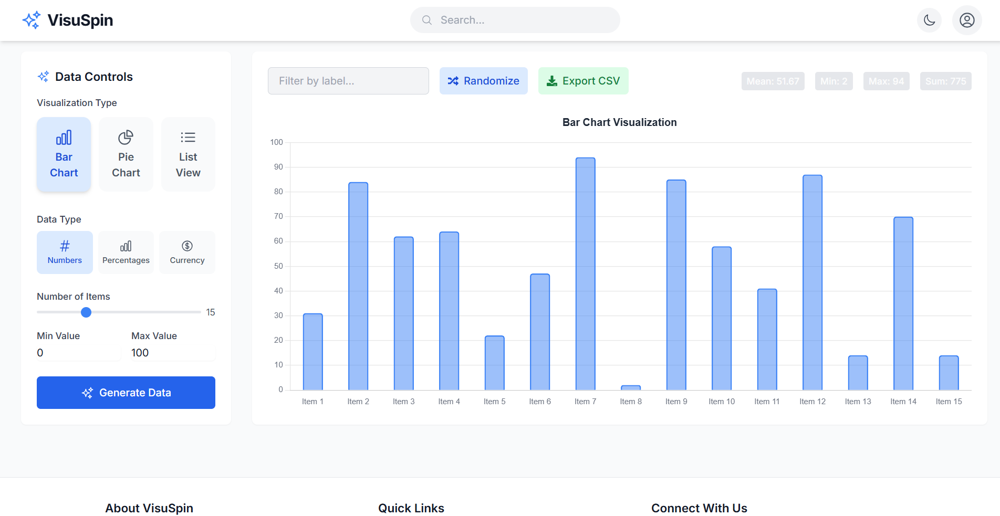

# VisuSpin

VisuSpin is a modern, interactive data visualization platform built with React. Designed for hackathons and data enthusiasts, it allows users to generate, explore, and visualize random datasets instantly with beautiful, responsive charts and a world-class user experience.

## 🚀 Features

- **Instant Data Generation:** Create random datasets with customizable size and value range.
- **Multiple Visualization Types:** Switch between Bar Chart, Pie Chart, and List View with a single click.
- **Smart Filtering:** Filter data by label with live updates to all visualizations.
- **Live Statistics:** See mean, min, max, and sum for your current dataset.
- **Export & Share:** Export your data as CSV or download charts as images (PNG coming soon!).
- **Randomize & Edit:** Shuffle your data for new insights, and (soon) edit values inline.
- **Modern UI/UX:** Responsive, dark/light mode, animated transitions, and accessibility built-in.
- **Customizable:** Choose data types (numbers, percentages, currency) and visualization options.
- **Fun & Delight:** Confetti, smooth animations, and a beautiful interface make data exploration fun.

## 🖥️ Demo



## ✨ Getting Started

1. **Clone the repository:**
   ```bash
   git clone https://github.com/jatin-shewale/VisuSpin.git
   cd VisuSpin/Frontend
   ```
2. **Install dependencies:**
   ```bash
   npm install
   ```
3. **Run the development server:**
   ```bash
   npm run dev
   ```
4. **Open in your browser:**
   Visit [http://localhost:5173](http://localhost:5173) (or the port shown in your terminal).

## 🏆 Why VisuSpin is a Hackathon Winner
- **Instant, beautiful data exploration** for demos and presentations.
- **Highly interactive**: filtering, randomizing, exporting, and (soon) editing.
- **Modern, responsive UI** that works on any device.
- **Easy to extend**: add new chart types, data sources, or AI insights.
- **Fun to use**: animations, dark mode, and delightful details.

## 📦 Tech Stack
- **Frontend:** React, Vite, TailwindCSS, Chart.js, Framer Motion, React-Icons
- **State Management:** React Hooks
- **Export:** CSV (PNG coming soon)

## 📄 License

MIT License. See [LICENSE](./LICENSE) for details.

---
